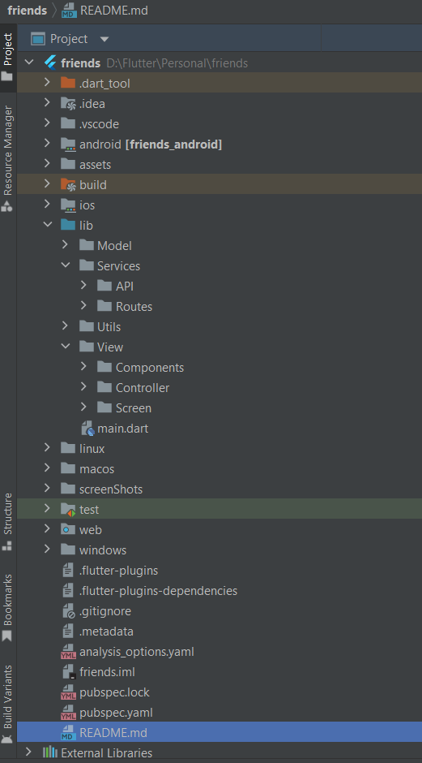
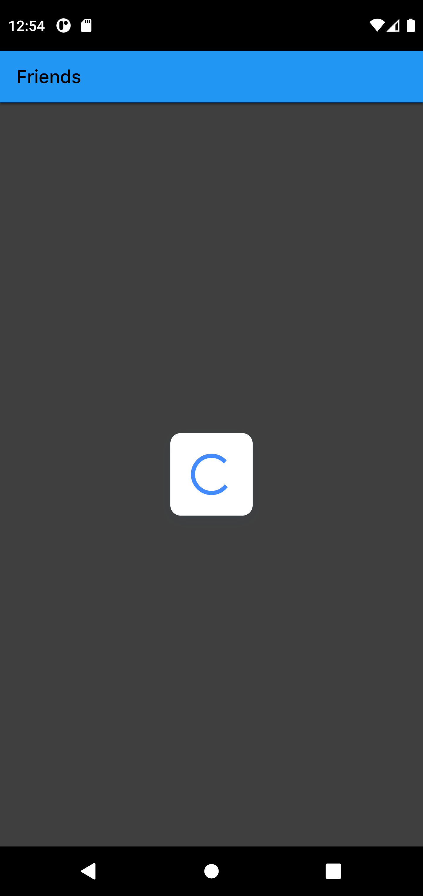
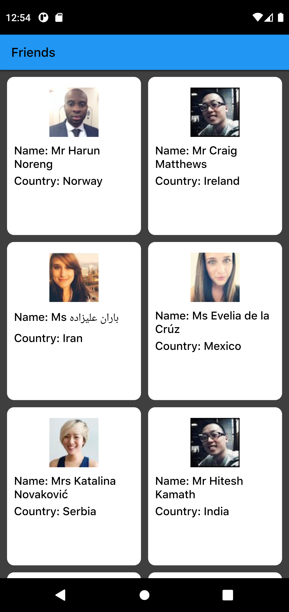
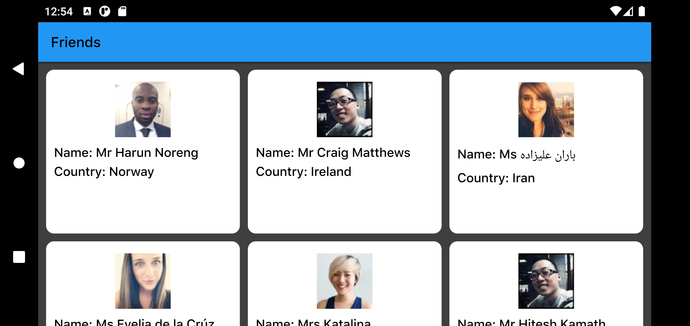
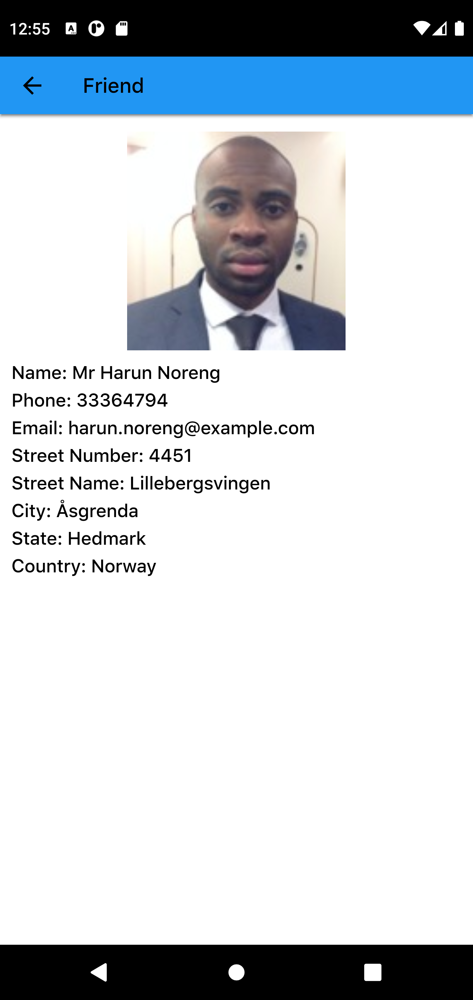
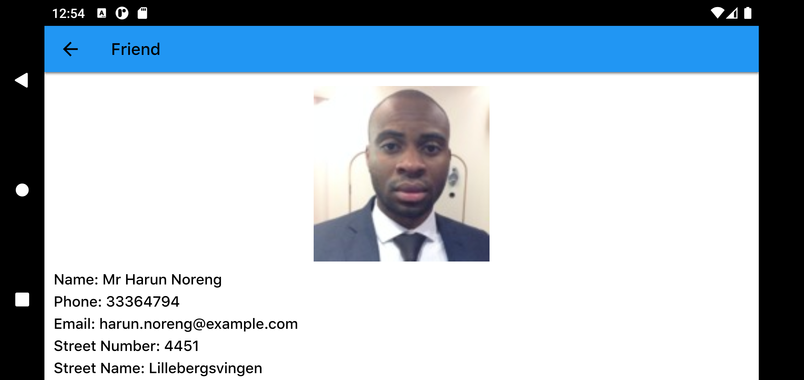

# Friends App
Just showing list of Friends and it's details

# SDK
Flutter SDK: 3.10.6
Dart SDK: 3.0.6

# Dependencies:
* dio
* get
* url_launcher

# The Project:

You can run this project:

1. Direct on Android Studio Emulator by this [link](https://github.com/RashadZA/Friends)
2. Physical Device. [Apk_link](https://drive.google.com/file/d/1hz7mTGlgQOUiN0O4VpS_6OoOe5y6b25r/view?usp=sharing)

# Permission:
* Storage permission needed

# How to Use the Project:

* After install APK and opening app Friends screen will show.
* Tapping on a friend card it will navigate to a detailed view of the friend displaying.
* Tapping on the friend’s email the mail app will open for sending email.

## Inside Structure of Lib Directory Screenshots

## APP Screenshots:

